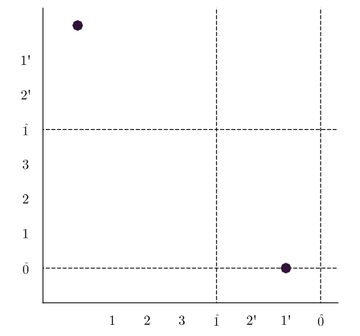

# Bipathposets
 A computation for bipath persistent homology using Julia. The computational method is given in the paper "Bipath Persistence" <a href="https://arxiv.org/abs/2404.02536"> arXiv:2404.02536 </a> by Toshitaka Aoki, Emerson G. Escolar, and Shunsuke Tada.

# Basic use
We treat bipath filtration of simplicial complexes, which is seen as a pair of filtration sharing the same spaces at their ends. 
For example, 
```
julia> FSCa = [[ [[1],1], [[2],1], [[1,2],2] ],  5]
julia> FSCb = [[ [[1],1], [[2],1], [[1,2],3] ],  4]
```
are two filtrations sharing the same spaces at their ends. As for FSCa, the simplicies [1] and [2] are born at 1, the simplex [1,2] is born at 2. No simplicies are born at 3,4, and 5. The second element of the list (FSCa[2]), which is 5, represents the length of the filtration.    

Our main function is "Bipathposets.bipathpersistence" whose arguments are two filtrations of simplicial complexes sharing the same spaces at their ends. Its output is a list with three elements. The first element in the list is a dictionary and the second, and third are integers meaning the length of each filtration.
```
julia> bipath = Bipathposets.bipathpersistence(FSCa,FSCb)
(Dict{Any, Any}(0 => Vector{Any}[[[[1, 1], [1, 2]]], [], [], [[1, 5]], []]), 5, 4)
```
In calculation, the following will be printed.
```
 ∃ 0_th homology, #[̂0,̂1] is 1
intervals with ̂0: <1', ̂0>
intervals with ̂1:
intervals up:
intervals down:
```
The explanation of  the notation <-,->, ̂1, and ̂0 can be seen in the above paper. 

If we want the persistence of i-th homology group in the bipath filtration, we compute
```
julia> bipath[1][i]
```
If we want to visualize the persistence of i-th homology group in the bipath filtration, we compute
```
julia> Bipathposets.plotintlist(bipath,i)
```
For example, let i be 0, we obtain the following diagram.


# Contributors:
・<a href="https://shunsuketada1357.github.io/">Shunsuke Tada</a> (main developer)
・Toshitaka Aoki
