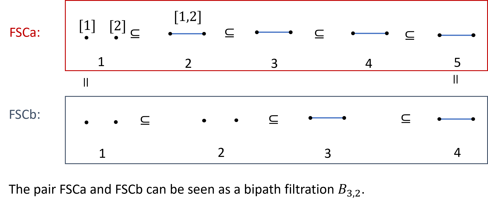

# Bipathposets
 A computation for bipath persistent homology using Julia. The computational method is given in the paper "Bipath Persistence" <a href="https://arxiv.org/abs/2404.02536"> arXiv:2404.02536 </a> by Toshitaka Aoki, Emerson G. Escolar, and Shunsuke Tada.

# Basic use
We treat a bipath filtration of simplicial complexes, which is seen as a pair of filtration sharing the same spaces at their ends. 
For example, 
```
julia> FSCa = [[ [[1],1], [[2],1], [[1,2],2] ],  5]
julia> FSCb = [[ [[1],1], [[2],1], [[1,2],3] ],  4]
```
are two filtrations sharing the same spaces at their ends. As for FSCa, the simplicies [1] and [2] are born at 1, the simplex [1,2] is born at 2. No simplicies are born at 3,4, and 5. The second element of the list (FSCa[2]), which is 5, represents the length of the filtration.
<div style="text-align:center;">
    
</div>
Our main function is "Bipathposets.bipathpersistence" whose arguments are two filtrations of simplicial complexes sharing the same spaces at their ends. Its output is a list with three elements. The first element in the list is a dictionary and the second, and third are integers meaning the length of each filtration.

```
julia> using Bipathposets
julia> bipath = Bipathposets.bipathpersistence(FSCa,FSCb)
(Dict{Any, Any}(0 => Vector{Any}[[[[1, 1], [1, 2]]], [], [], [[1, 5]], []]), 5, 4)
```

The following will be printed.

```
 ∃ 0_th homology, #[̂0,̂1] is 1
intervals with ̂0: <1', ̂0>
intervals with ̂1:
intervals up:
intervals down:
```

The explanation of  the notation <-,->, ̂1, and ̂0 can be seen in the above paper. 

If we want the persistence of i-th homology group in the bipath filtration, we compute
```
julia> bipath[1][i]
```
If we want to visualize the persistence of i-th homology group in the bipath filtration, we compute
```
julia> Bipathposets.plotintlist(bipath,i)
```
For example, let i be 0, we obtain the following diagram.


# Install

1. Open Julia.
```
               _
   _       _ _(_)_     |  Documentation: https://docs.julialang.org
  (_)     | (_) (_)    |
   _ _   _| |_  __ _   |  Type "?" for help, "]?" for Pkg help.
  | | | | | | |/ _` |  |
  | | |_| | | | (_| |  |  Version 1.9.3 (2023-08-24)
 _/ |\__'_|_|_|\__'_|  |  Official https://julialang.org/ release
|__/                   |

julia>
```
Then, get into the Pkg REPL by pressing ```]```.
```
(@v1.9) pkg>
```
2. Enter "add https://github.com/ShunsukeTada1357/Bipathposets.git" 
```
(@v1.9) pkg> add https://github.com/ShunsukeTada1357/Bipathposets.git
```
3. Enter "status" to check the package is installed.
```
(@v1.9) pkg> status
```
Then, the following screen will be displayed (but the file, folder name, etc. will be different).
```
Status `C:\Users\kyoro\.julia\environments\v1.9\Project.toml`
  [c3fe647b] AbstractAlgebra v0.43.5
  [b99e7846] BinaryProvider v0.5.10
  [6552261a] Bipathposets v1.0.0-DEV `https://github.com/ShunsukeTada1357/Bipathposets.git#main`
  [861a8166] Combinatorics v1.0.2
  [c87230d0] FFMPEG v0.4.2
  [91a5bcdd] Plots v1.40.8
  [55797a34] SimpleGraphs v0.8.6
Info Packages marked with ⌃ have new versions available and may be upgradable.
```
We can see ```[6552261a] Bipathposets v1.0.0-DEV `https://github.com/ShunsukeTada1357/Bipathposets.git#main` ```. 
We complete the installation.

# Uninstall
In Pkg mode, we enter the following:
```
(@v1.9) pkg> rm Bipathposets
```
and we can uninstall the package.

# Troubleshooting
After uninstalling the package "Bipathposets", enter
```
(@v1.9) pkg> up
```
and 
```
(@v1.9) pkg> build FFMPEG
```
and install the package "Bipathposets" again. This procedure could solve problems.


# Contributors:
・Toshitaka Aoki

・<a href="https://emerson-escolar.github.io/index.html">Emerson G. Escolar</a> 

・<a href="https://shunsuketada1357.github.io/">Shunsuke Tada</a> (main developer)

This project was partially supported by Grant-in-Aid for Transformative Research Areas（A）22H05105.
